# 边框缓存机自动工艺流程图

## 1. 文档基础信息
- **文档标题**：边框缓存机自动工艺流程图
- **文档版本**：FLOW-V1.0.0
- **编制日期**：2026-04-22
- **更新日期**：2026-04-22
- **适用范围**：边框缓存机项目 (DJ-2026-005)

## 2. 自动工艺流程图

```mermaid
graph TD
    subgraph 系统控制
        A[开始] --> B[系统初始化]
        B --> C{初始化完成?}
        C -->|否| B
        C -->|是| D[系统就绪]
        D --> E{启动信号?}
        E -->|否| D
        E -->|是| F[系统运行]
        F --> G{停止信号?}
        G -->|是| H[系统停止中]
        H --> I[系统空闲]
        I --> A
        G -->|否| J{安全故障?}
        J -->|是| K[系统故障]
        K --> L{故障复位?}
        L -->|是| I
        L -->|否| K
        J -->|否| M{暂停信号?}
        M -->|是| N[系统暂停]
        N --> O{继续信号?}
        O -->|是| F
        O -->|否| N
        M -->|否| P{打胶机允许送料?}
    end

    subgraph 物料状态判断
        P -->|否| F
        P -->|是| Q[物料状态判断]
        Q --> R{物料状态}
        R -->|没有料| S[延时1s]
        S --> T[前夹爪位置需要物料]
        T --> U{X1,Z轴取物料到位?}
        U -->|是| V[前夹爪有料]
        R -->|前夹爪无料| W[出料完成回转机点]
        W --> T
        R -->|后夹爪无料;前夹爪有料| X[出料完成回转机点]
        X --> Y[后夹爪位置需要物料]
        Y --> Z{X1,Z轴取物料到位?}
        Z -->|是| AA[后夹爪有料]
        R -->|全部有料| BB[X1,Z轴待机中]
        BB --> CC[给下游设备信号本站请求出料]
        CC --> DD{下游允许?}
        DD -->|是| EE[X2轴移动到出料点]
    end

    subgraph 分料流程
        V --> FF[分料空闲]
        AA --> FF
        EE --> FF
        FF --> GG{启动信号?}
        GG -->|是| HH[阻挡下降]
        HH --> II{阻挡气缸到位?}
        II -->|否| HH
        II -->|是| JJ[输送前进]
        JJ --> KK{输送时间到?}
        KK -->|否| JJ
        KK -->|是| LL[停止输送]
        LL --> MM[阻挡上升]
        MM --> NN{阻挡气缸到位?}
        NN -->|否| MM
        NN -->|是| OO[分料推出]
        OO --> PP{分料气缸到位?}
        PP -->|否| OO
        PP -->|是| QQ[分料复位]
        QQ --> RR{分料气缸复位?}
        RR -->|否| QQ
        RR -->|是| SS[分料完成]
    end

    subgraph 取放料流程
        SS --> TT[取放料空闲]
        TT --> UU{取料触发?}
        UU -->|是| VV[取料机构移动到取料位置]
        VV --> WW{移动到位?}
        WW -->|否| VV
        WW -->|是| XX[取料下降]
        XX --> YY{下降到位?}
        YY -->|否| XX
        YY -->|是| ZZ[取料夹紧]
        ZZ --> AAA{夹紧到位?}
        AAA -->|否| ZZ
        AAA -->|是| BBB[取料上升]
        BBB --> CCC{上升到位?}
        CCC -->|否| BBB
        CCC -->|是| DDD[移动到放料位置]
        DDD --> EEE{移动到位?}
        EEE -->|否| DDD
        EEE -->|是| FFF[放料下降]
        FFF --> GGG{下降到位?}
        GGG -->|否| FFF
        GGG -->|是| HHH[放料松开]
        HHH --> III{松开到位?}
        III -->|否| HHH
        III -->|是| JJJ[放料上升]
        JJJ --> KKK{上升到位?}
        KKK -->|否| JJJ
        KKK -->|是| LLL[取放料完成]
    end

    subgraph 与打胶机交互
        LLL --> MMM[向打胶机发送允许抓料信号]
        MMM --> NNN{打胶机取料完成?}
        NNN -->|否| MMM
        NNN -->|是| F
    end
```

## 3. 流程图说明

此流程图描述了边框缓存机的完整自动工艺流程，包括以下几个主要部分：

1. **系统控制**：包括系统初始化、就绪、运行、停止、故障和暂停等状态转换
2. **物料状态判断**：根据不同的物料状态（没有料、前夹爪无料、后夹爪无料/前夹爪有料、全部有料）进行不同的处理
3. **分料流程**：包括阻挡下降、输送前进、停止输送、阻挡上升、分料推出和分料复位等步骤
4. **取放料流程**：包括取料机构移动、取料下降、取料夹紧、取料上升、移动到放料位置、放料下降、放料松开和放料上升等步骤
5. **与打胶机交互**：包括接收打胶机的允许送料信号、向打胶机发送允许抓料信号、接收打胶机的取料完成信号等步骤

## 4. 版本更新记录

| 版本 | 日期 | 更新内容 | 编制人 |
|------|------|----------|--------|
| V1.0.0 | 2026-04-22 | 初始版本创建，包含完整的自动工艺流程图 | System |
