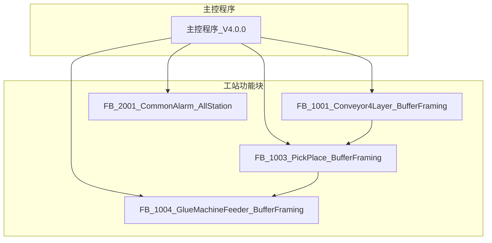

# 边框缓存机 PLC程序架构文档

## 文档基础信息

| 属性 | 值 |
|------|-----|
| **文档标题** | 边框缓存机 PLC程序架构文档 |
| **文档版本** | V4.0.0 |
| **编制日期** | 2026-04-23 |
| **编制人** | Trae |
| **审核人** | [待审核] |
| **遵循规范** | 050_模板结构规范_TPL-V1.0.0, 810_PLC编程规范_DEV-V1.0.0, 801_PLC变量命名与功能块命名规范_DEV-V1.0.2 |

## 版本变更记录

| 版本号 | 变更内容 | 变更人 | 变更日期 | 详细说明 |
|--------|----------|--------|----------|----------|
| V4.0.0 | V4.0.0架构重构: 扁平化组件架构,801命名规范全面适配,文档同步更新 | Trae | 2026-04-23 | 初始V4版本,含FB重命名(5个→801规范)、变量前缀统一(30处)、文档全面同步(7个文档~200处) |

## 1. 系统架构概览

### 1.1 整体架构

## 2. 组件结构

### 2.1 扁平化组件架构

| 组件名称 | 类型 | 核心职责 | 文件位置 |
|---------|------|---------|----------|
| 主控程序 | PROGRAM | IO映射、HMI交互、工站协调 | [主控/主控程序_V4.0.0.st](主控/主控程序_V4.0.0.st) |
| FB_1001_Conveyor4Layer_BufferFraming | FUNCTION_BLOCK | 4层独立分料/输送控制 | [四层输送机/FB_1001_Conveyor4Layer_BufferFraming_V4.0.0.st](四层输送机/FB_1001_Conveyor4Layer_BufferFraming_V4.0.0.st) |
| FB_1003_PickPlace_BufferFraming | FUNCTION_BLOCK | Z轴升降+X1轴横移+夹爪控制 | [取放料机构/FB_1003_PickPlace_BufferFraming_V4.0.0.st](取放料机构/FB_1003_PickPlace_BufferFraming_V4.0.0.st) |
| FB_1004_GlueMachineFeeder_BufferFraming | FUNCTION_BLOCK | X2轴横移+打胶机交互 | [打胶机送料机构/FB_1004_GlueMachineFeeder_BufferFraming_V4.0.0.st](打胶机送料机构/FB_1004_GlueMachineFeeder_BufferFraming_V4.0.0.st) |
| FB_2001_CommonAlarm_AllStation | FUNCTION_BLOCK | 三站报警汇总+全局报警字+MES队列 | [公共服务/FB_2001_CommonAlarm_AllStation_V4.0.0.st](公共服务/FB_2001_CommonAlarm_AllStation_V4.0.0.st) |

### 2.2 架构对比

| 对比项 | V3.0.0 (旧架构) | V4.0.0 (新架构) |
|--------|------------------|------------------|
| **架构模式** | 三层碎片化架构(Device+Logic+Main=21个FB) | 扁平化组件架构(主控+3工站+公共报警=5个组件) |
| **功能块数量** | 21个功能块 | 5个组件(1个PROGRAM + 4个FUNCTION_BLOCK) |
| **IO映射方式** | 分散在各Device层FB中 | 集中在主控程序(主控程序承担所有X/Y映射) |
| **物理地址依赖** | Device层FB直接引用X/Y/M/D地址 | 所有工站FB为纯逻辑块，无任何物理地址引用 |
| **数据耦合度** | 高(多层传递，接口复杂) | 低(主控统一协调，工站接口清晰) |
| **D区规划** | 无统一规划 | 新增D400~D425固定分配(报警系统专用) |
| **M区规划** | 无统一规划 | M200全局互锁，M100~M149 HMI控制/状态 |

## 3. 系统功能模块

### 3.1 主控程序

- **功能**：系统核心，负责IO映射、HMI交互、工站实例化与调用、报警D区回写
- **输入**：所有物理IO信号、HMI控制信号
- **输出**：所有执行器控制信号、HMI状态信号、D区报警数据
- **文件**：[主控程序_V4.0.0.st](主控/主控程序_V4.0.0.st)

### 3.2 FB_1001_Conveyor4Layer_BufferFraming

- **功能**：4层独立分料/输送控制，每层9步自动状态机
- **输入**：各层传感器信号、手动操作信号、工艺参数
- **输出**：各层执行器控制信号、放料完成信号、报警代码
- **文件**：[FB_1001_Conveyor4Layer_BufferFraming_V4.0.0.st](四层输送机/FB_1001_Conveyor4Layer_BufferFraming_V4.0.0.st)
- **内部组件**：FB_1002_SingleLayerConveyor_BufferFraming（4个实例）

### 3.3 FB_1003_PickPlace_BufferFraming

- **功能**：Z轴升降+X1轴横移+夹爪控制，11步状态机，一次取两根边框
- **输入**：升降/夹紧气缸传感器、伺服轴传感器、产品检测传感器、上游输送机信号
- **输出**：气缸控制信号、伺服控制信号、放料完成信号、报警代码
- **文件**：[FB_1003_PickPlace_BufferFraming_V4.0.0.st](取放料机构/FB_1003_PickPlace_BufferFraming_V4.0.0.st)

### 3.4 FB_1004_GlueMachineFeeder_BufferFraming

- **功能**：X2轴横移+打胶机交互，6步状态机，含安全区管理
- **输入**：X2轴传感器、打胶机交互信号、上游取放料信号
- **输出**：X2轴控制信号、打胶机交互信号、报警代码
- **文件**：[FB_1004_GlueMachineFeeder_BufferFraming_V4.0.0.st](打胶机送料机构/FB_1004_GlueMachineFeeder_BufferFraming_V4.0.0.st)

### 3.5 FB_2001_CommonAlarm_AllStation

- **功能**：三站报警汇总、全局报警字计算、MES报警队列管理、多报警状态输出
- **输入**：各工站报警代码
- **输出**：全局报警字、最高优先级报警码、MES报警队列、报警状态数组、报警触发BOOL量
- **文件**：[FB_2001_CommonAlarm_AllStation_V4.0.0.st](公共服务/FB_2001_CommonAlarm_AllStation_V4.0.0.st)

## 4. 信号流程

### 4.1 输入信号流程

1. 物理IO信号 → 主控程序IO映射 → 逻辑变量
2. 逻辑变量 → 各工站功能块输入
3. 工站功能块处理 → 工站功能块输出
4. 工站功能块输出 → 主控程序 → 执行器控制/状态反馈

### 4.2 控制流程

1. 系统启动 → 主控程序初始化 → 各工站初始化
2. 手动/自动模式选择
3. 启动按钮 → 系统运行
4. 四层输送机 → 分料送料
5. 取放料机构 → 产品搬运
6. 打胶机送料机构 → 与打胶机协作
7. 公共报警 → 报警监控

## 5. 关键技术特点

### 5.1 扁平化组件架构

- **主控程序**：集中IO映射，统一协调各工站
- **工站功能块**：纯逻辑块，无物理地址依赖，高内聚低耦合
- **接口标准化**：各工站接口清晰，易于维护和扩展

### 5.2 状态机控制

- 四层输送机：9步自动状态机
- 取放料机构：11步完整取放料循环
- 打胶机送料机构：6步送料循环
- 提高系统稳定性和可维护性

### 5.3 模块化设计

- 功能块独立封装，便于维护和扩展
- 标准化接口，降低模块间耦合
- 工站解耦，可独立调试和测试

### 5.4 安全保护

- 完善的安全信号处理
- 急停、安全门等安全功能
- 符合ISO 13849-1安全标准

### 5.5 报警系统

- 分级报警机制
- 详细的报警代码和指示
- MES报警队列管理
- 多报警同时显示功能
- 报警触发BOOL量输出，支持HMI显示

## 6. 系统配置

### 6.1 硬件配置

- **CPU**：支持ST语言的PLC
- **DI模块**：扩展输入模块
- **DO模块**：扩展输出模块
- **远程IO**：用于取放料机构
- **伺服驱动器**：控制伺服轴
- **变频器**：控制输送带

### 6.2 软件配置

- **编程软件**：支持IEC 61131-3标准
- **程序结构**：扁平化组件设计
- **变量管理**：统一命名规范，集中IO映射

## 7. 维护与扩展

### 7.1 维护要点

- 定期检查IO信号状态
- 定期测试安全功能
- 检查报警记录
- 备份程序和参数

### 7.2 扩展建议

- 可扩展更多层的缓存
- 可增加更多类型的传感器
- 可集成更多外部设备
- 可添加远程监控功能

## 8. 文档索引

| 文档类型    | 描述      | 文件位置                                                                                                 |
| ------- | ------- | ---------------------------------------------------------------------------------------------------- |
| 接口文档    | 功能块接口定义 | 各功能块文件夹下                                                                                             |
| 使用说明    | 功能块使用指南 | 各功能块文件夹下                                                                                             |
| 报警码定义  | 报警代码定义 | [公共服务/报警码定义_ALM-DJ-2026-005-V4.0.0.md](公共服务/报警码定义_ALM-DJ-2026-005-V4.0.0.md) |
| 程序设计总文档 | 整体程序设计  | [程序文档/016\_DJ-2026-005\_PLC程序设计总文档\_PLC-V4.0.0.md](../程序文档/016_DJ-2026-005_PLC程序设计总文档_PLC-V4.0.0.md) |
| IO分配表   | IO点位定义  | [程序文档/015\_DJ-2026-005\_IO分配表\_IO-V3.0.0.md](../程序文档/015_DJ-2026-005_IO分配表_IO-V3.0.0.md)             |
| 变量定义文档 | 变量定义和说明 | [PLC变量定义文档_VAR-DJ-2026-005-V4.0.0.md](PLC变量定义文档_VAR-DJ-2026-005-V4.0.0.md) |

## 9. 版本信息

- **程序版本**：V4.0.0
- **编制日期**：2026-04-23
- **遵循规范**：IEC 61131-3, 810\_PLC编程规范\_DEV-V1.0.0
- **项目编号**：DJ-2026-005

