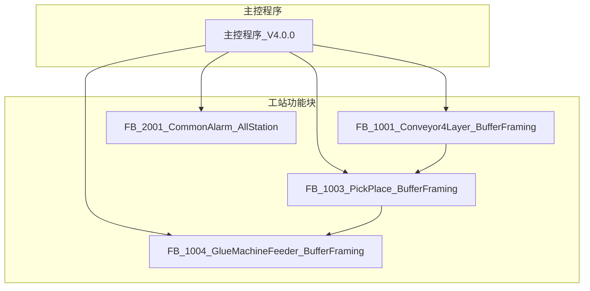

# 边框缓存机 PLC程序详细设计说明书

## 文档基础信息

| 属性 | 值 |
|------|-----|
| **文档标题** | 边框缓存机 PLC程序详细设计说明书 |
| **文档版本** | V4.0.1 |
| **编制日期** | 2026-04-24 |
| **编制人** | Trae |
| **审核人** | [待审核] |
| **遵循规范** | 050_模板结构规范_TPL-V1.0.0, 810_PLC编程规范_DEV-V1.0.0, 801_PLC变量命名与功能块命名规范_DEV-V1.0.2 |

## 版本变更记录

| 版本号 | 变更内容 | 变更人 | 变更日期 | 详细说明 |
|--------|----------|--------|----------|----------|
| V4.0.2 | 新增打胶机/组框机外部设备交互接口预留; 协调逻辑框架; 文档同步更新 | Trae | 2026-04-24 | 打胶机接口扩展(2DI→6DI, 2DO→4DO); 组框机新增预留接口(7DI+5DO); Step3外部信号处理逻辑(安全联锁/开门互锁/握手协议); 程序架构图更新 |
| V4.0.1 | 取放料/打胶机送料FB接口输出补全; 手动操作点数量同步更新 | 技术文档专家 | 2026-04-24 | 取放料FB新增4个VAR_OUTPUT(前夹紧2/后夹紧2气缸控制,6→10个); 打胶机送料FB新增2个VAR_OUTPUT(X2轴运动请求); 手动操作点14→18(取放料机构); 文档接口描述同步修订 |
| V4.0.0 | V4.0.0架构重构: 扁平化组件架构,801命名规范全面适配,文档同步更新 | Trae | 2026-04-23 | 初始V4版本,含FB重命名(5个→801规范)、变量前缀统一(30处)、文档全面同步(7个文档~200处) |

## 1. 概述

### 1.1 文档目的

本文档详细描述了边框缓存机PLC程序的设计方案，包括系统架构、功能模块、程序流程、IO分配等内容，为系统的开发、调试和维护提供技术依据。

### 1.2 术语定义

| 术语 | 解释 |
|------|------|
| FB | Function Block，功能块 |
| ST | Structured Text，结构化文本 |
| IO | Input/Output，输入/输出 |
| PLC | Programmable Logic Controller，可编程逻辑控制器 |
| HMI | Human Machine Interface，人机界面 |
| VFD | Variable Frequency Drive，变频器 |
| DI | Digital Input，数字输入 |
| DO | Digital Output，数字输出 |

## 2. 系统架构

### 2.1 整体架构

系统采用扁平化组件架构设计：

1. **主控程序**：系统核心，负责IO映射、HMI交互、工站协调
2. **工站功能块**：纯逻辑块，实现具体业务逻辑
3. **公共服务**：提供公共功能，如报警管理

### 2.2 组件层次结构



## 3. 主控程序设计

### 3.1 功能描述

主控程序是系统的核心，负责：
- 所有物理IO信号的映射（含内部传感器/执行器/外部设备）
- HMI交互和状态反馈
- **外部设备交互协调**（打胶机下游接口 + 组框机上游预留接口）
- 工站功能块的实例化和调用
- 报警系统的D区回写
- 安全继电器控制
- **设备间安全联锁与互锁逻辑**

### 3.2 程序结构

主控程序 [主控程序_V4.0.0.st](主控/主控程序_V4.0.0.st) 采用结构化设计，主要包括：

1. **变量声明区**：工站实例 + IO映射变量 + HMI变量 + **外部设备信号变量**
2. **输入映射区**：物理DI信号->逻辑变量（含**打胶机/组框机DI**）
3. **HMI读取区**：M/D区->逻辑变量
4. **外部信号处理区**：**打胶机有效性检查 + 组框机安全联锁/开门互锁**
5. **工站调用区**：按顺序调用各工站功能块
6. **输出映射区**：逻辑变量->物理DO信号（含**打胶机/组框机DO**）
7. **HMI回写区**：逻辑变量->M/D区
8. **D区回写区**：报警数据的D区写入

### 3.3 主程序流程

| 步骤 | 功能 | 说明 |
|------|------|------|
| Step1 | IO映射输入 | X地址->逻辑变量，含**打胶机(X75-X79,X102) + 组框机(预留)** |
| Step2 | HMI数据读取 | M/D区->逻辑变量（模式/按钮/参数/手动操作） |
| Step3 | **外部设备信号处理** | **打胶机通讯检查 + 组框机急停联锁 + 开门互锁 + 就绪生成** |
| Step4 | 调用四层输送机 | 工站1：分料/输送控制 |
| Step5 | 调用取放料机构 | 工站2：取放料控制 |
| Step6 | 调用打胶机送料机构 | 工站3：送料控制（传入**打胶机交互信号**） |
| Step7 | 调用公共报警 | 工站4：报警汇总 |
| Step8 | IO映射输出 | 逻辑变量->Y地址，含**打胶机(Y40/Y41/Y44/Y47) + 组框机(预留)** |
| Step9 | HMI状态回写 | 逻辑变量->M/D区 |
| Step10 | 报警D区回写 | 公共报警输出->D400起始 |

### 3.4 外部设备交互协议

```
┌───────────┐    边框流入     ┌──────────────┐    边框流出    ┌───────────┐
│           │ ──────────────> │              │ ──────────────> │           │
│  组框机   │               │  边框缓存机   │               │  打胶机   │
│ (上游)    │ <────────────── │   (本设备)    │ <────────────── │ (下游)    │
│           │   控制/状态信号 │              │   控制/状态信号 │           │
└───────────┘               └──────────────┘               └───────────┘
     ↑ 预留接口(7DI+5DO)          ↓                           ↑ 已定义(6DI+4DO)
```

### 3.4 关键代码片段

```st
// 工站实例化
fb四层输送机 : FB_1001_Conveyor4Layer_BufferFraming;
fb取放料机构 : FB_1003_PickPlace_BufferFraming;
fb打胶机送料机构 : FB_1004_GlueMachineFeeder_BufferFraming;
fb公共报警 : FB_2001_CommonAlarm_AllStation;

// IO映射
// 输入映射
bZ轴_原点 := X0;
bX1轴_原点 := X1;
bX2轴_原点 := X2;
// ... 其他输入映射

// 工站调用
fb四层输送机(
    i_b使能 := b系统使能,
    i_b自动模式 := bHMI_自动模式,
    i_b手动模式 := bHMI_手动模式,
    // ... 其他输入
    o_阻挡电磁阀 => i_bLx_阻挡电磁阀,
    o_分料电磁阀 => i_bLx_分料电磁阀,
    // ... 其他输出
);

// 输出映射
Y0 := fb取放料机构.o_Z轴_脉冲输出;
Y4 := fb取放料机构.o_Z轴_方向输出;
Y10 := fb取放料机构.o_Z轴_伺服使能;
// ... 其他输出映射

// D区回写
D400 := fb公共报警.o_w全局报警字;
D402 := fb公共报警.o_i当前报警代码;
// ... 其他D区回写
```

## 4. 工站功能块设计

### 4.1 FB_1001_Conveyor4Layer_BufferFraming

#### 4.1.1 功能描述

实现4层独立的分料/输送控制，每层包含9步自动状态机，支持手动/自动模式。

#### 4.1.2 内部结构

- **容器架构**：内部实例化4个FB_1002_SingleLayerConveyor_BufferFraming
- **信号路由**：负责输入分发和输出收集
- **状态汇总**：汇总4层状态和报警

#### 4.1.3 状态机设计

| 状态 | 值 | 描述 |
|------|-----|------|
| STP_空闲 | 0 | 空闲待机 |
| STP_检测材料到位 | 1 | 等待分料前感应器信号 |
| STP_阻挡下降 | 2 | 阻挡气缸下降到位 |
| STP_输送正转 | 3 | 输送带正转运料 |
| STP_到位检测 | 4 | 等待双传感器到位确认 |
| STP_阻挡上升 | 5 | 阻挡气缸上升释放 |
| STP_分料动作 | 6 | 分料气缸推出分离 |
| STP_慢速送出 | 7 | 慢速精确送出 |
| STP_放料完成 | 8 | 放料完成，等待取料 |

#### 4.1.4 相关文档

| 文档类型 | 文档名称 | 核心内容 |
|---------|:--------|:--------|
| **详细设计说明书 (DSN)** | [详细设计说明书_DSN-FB1001-Conveyor4Layer-V4.0.0.md](四层输送机/详细设计说明书_DSN-FB1001-Conveyor4Layer-V4.0.0.md) | 两级层次结构、9步状态机、容器分发收集机制 |
| **接口文档 (IFC)** | [接口文档_IFC-FB1001-Conveyor4Layer-V4.0.0.md](四层输送机/接口文档_IFC-FB1001-Conveyor4Layer-V4.0.0.md) | 单层24输入/10输出 + 容器公共+分层接口定义 |
| **使用说明 (UM)** | [使用说明_UM-FB1001-Conveyor4Layer-V4.0.0.md](四层输送机/使用说明_UM-FB1001-Conveyor4Layer-V4.0.0.md) | ST调用示例(容器+单层)、IO地址映射表、多层联动测试 |
| **变更记录 (CHG)** | [变更记录_CHG-FB1001-Conveyor4Layer-V4.0.0.md](四层输送机/变更记录_CHG-FB1001-Conveyor4Layer-V4.0.0.md) | V3→V4重构记录、FB重命名历史、版本变更台帐 |

### 4.2 FB_1003_PickPlace_BufferFraming

#### 4.2.1 功能描述

实现Z轴升降、X1轴横移和夹爪控制，包含11步完整取放料循环，一次取两根边框。

#### 4.2.2 状态机设计

| 状态 | 值 | 描述 |
|------|-----|------|
| STP_空闲 | 0 | 空闲待机 |
| STP_等待放料完成 | 1 | 等待输送机放料完成信号 |
| STP_取料下降 | 2 | Z轴下降到取料高度 |
| STP_夹爪夹紧 | 3 | 前后夹紧同时夹紧(一次取两根) |
| STP_产品检测 | 4 | 产品检测确认(4传感器全检测到) |
| STP_取料上升 | 5 | Z轴上升到安全高度 |
| STP_移动到放料位置 | 6 | X1轴移动到放料位置(打胶机侧) |
| STP_放料下降 | 7 | Z轴下降到放料高度 |
| STP_夹爪松开 | 8 | 前后夹紧同时松开 |
| STP_放料上升 | 9 | Z轴上升到安全高度 |
| STP_放料完成通知 | 10 | 发送放料完成信号给下游 |

#### 4.2.3 相关文档

| 文档类型 | 文档名称 | 核心内容 |
|---------|:--------|:--------|
| **详细设计说明书 (DSN)** | [详细设计说明书_DSN-FB1003-PickPlace-V4.0.0.md](取放料机构/详细设计说明书_DSN-FB1003-PickPlace-V4.0.0.md) | 11步状态机、4层循环逻辑、双夹爪控制、产品检测 |
| **接口文档 (IFC)** | [接口文档_IFC-FB1003-PickPlace-V4.0.0.md](取放料机构/接口文档_IFC-FB1003-PickPlace-V4.0.0.md) | 52个输入/18个输出的完整定义、报警码101~108 |
| **使用说明 (UM)** | [使用说明_UM-FB1003-PickPlace-V4.0.0.md](取放料机构/使用说明_UM-FB1003-PickPlace-V4.0.0.md) | ST调用示例、X1轴处理、上下游联调、层循环验证 |
| **变更记录 (CHG)** | [变更记录_CHG-FB1003-PickPlace-V4.0.0.md](取放料机构/变更记录_CHG-FB1003-PickPlace-V4.0.0.md) | 接口扩展历史、V3→V4重构记录、版本变更台帐 |

### 4.3 FB_1004_GlueMachineFeeder_BufferFraming

#### 4.3.1 功能描述

实现X2轴横移和打胶机交互，包含6步送料循环，支持安全区管理。

#### 4.3.2 状态机设计

| 状态 | 值 | 描述 |
|------|-----|------|
| STP_空闲 | 0 | 空闲待机 |
| STP_等待取放料完成 | 1 | 等待取放料机构放料完成 |
| STP_移动到取料位置 | 2 | X2轴移动到取料位置 |
| STP_等待打胶机允许 | 3 | 等待打胶机允许送料信号 |
| STP_移动到打胶机位置 | 4 | X2轴移动到打胶机位置 |
| STP_等待打胶机取料 | 5 | 等待打胶机取料完成 |
| STP_返回待机位置 | 6 | X2轴返回待机位置 |

#### 4.3.3 相关文档

| 文档类型 | 文档名称 | 核心内容 |
|---------|:--------|:--------|
| **详细设计说明书 (DSN)** | [详细设计说明书_DSN-FB1004-GlueMachineFeeder-V4.0.0.md](打胶机送料机构/详细设计说明书_DSN-FB1004-GlueMachineFeeder-V4.0.0.md) | 6步状态机、安全区管理、打胶机交互时序 |
| **接口文档 (IFC)** | [接口文档_IFC-FB1004-GlueMachineFeeder-V4.0.0.md](打胶机送料机构/接口文档_IFC-FB1004-GlueMachineFeeder-V4.0.0.md) | 18个输入/10个输出的完整定义、报警码201~205 |
| **使用说明 (UM)** | [使用说明_UM-FB1004-GlueMachineFeeder-V4.0.0.md](打胶机送料机构/使用说明_UM-FB1004-GlueMachineFeeder-V4.0.0.md) | ST调用示例、X2轴运动处理、参数调优、调试步骤 |
| **变更记录 (CHG)** | [变更记录_CHG-FB1004-GlueMachineFeeder-V4.0.0.md](打胶机送料机构/变更记录_CHG-FB1004-GlueMachineFeeder-V4.0.0.md) | V3→V4重构记录、后续变更追踪、版本变更台帐 |

### 4.4 FB_2001_CommonAlarm_AllStation

#### 4.4.1 功能描述

实现三站报警汇总、全局报警字计算和MES报警队列管理。

#### 4.4.2 报警处理逻辑

1. **报警输入收集**：接收各工站报警代码
2. **优先级计算**：选取最高优先级报警
3. **全局报警字**：计算所有非零报警的位或组合
4. **MES队列管理**：维护最近10条报警记录

#### 4.4.3 相关文档

| 文档类型 | 文档名称 | 核心内容 |
|---------|:--------|:--------|
| **详细设计说明书 (DSN)** | [详细设计说明书_DSN-FB2001-CommonAlarm-V4.0.0.md](公共服务/详细设计说明书_DSN-FB2001-CommonAlarm-V4.0.0.md) | 十步处理流程、四大核心算法(OR运算/优先级选取/MES队列/脉冲检测)、D/M区内存布局、报警码段分配原理 |
| **接口文档 (IFC)** | [接口文档_IFC-FB2001-CommonAlarm-V4.0.0.md](公共服务/接口文档_IFC-FB2001-CommonAlarm-V4.0.0.md) | 4输入/10输出完整定义、D400/D402/M200/D404~D425地址映射、15个内部变量说明 |
| **使用说明 (UM)** | [使用说明_UM-FB2001-CommonAlarm-V4.0.0.md](公共服务/使用说明_UM-FB2001-CommonAlarm-V4.0.0.md) | ST调用示例(含D/M区映射)、三站连接关系图、MES集成指南、HMI配置建议、调试流程 |
| **变更记录 (CHG)** | [变更记录_CHG-FB2001-CommonAlarm-V4.0.0.md](公共服务/变更记录_CHG-FB2001-CommonAlarm-V4.0.0.md) | V3→V4重构记录、跨域影响矩阵(3工站+主控+HMI+MES)、版本变更台帐 |
| **报警码定义** | [报警码定义_ALM-DJ-2026-005-V4.0.0.md](公共服务/报警码定义_ALM-DJ-2026-005-V4.0.0.md) | 全局20个报警码完整定义(输送机1~7 + 取放料101~108 + 送料201~205) |

## 5. IO分配

### 5.1 输入信号

| 信号类型 | 信号名称 | 物理地址 | 功能描述 | 映射目标 |
|----------|----------|----------|----------|----------|
| CPU输入 | Z轴原点 | X0 | Z轴原点传感器 | FB_1003_PickPlace_BufferFraming |
| CPU输入 | X1轴原点 | X1 | X1轴原点传感器 | FB_1003_PickPlace_BufferFraming |
| CPU输入 | X2轴原点 | X2 | X2轴原点传感器 | FB_1004_GlueMachineFeeder_BufferFraming |
| CPU输入 | Z轴正向限位 | X3 | Z轴正向限位(上限位) | FB_1003_PickPlace_BufferFraming |
| CPU输入 | Z轴反向限位 | X4 | Z轴反向限位(下限位) | FB_1003_PickPlace_BufferFraming |
| CPU输入 | X1轴正向限位 | X5 | X1轴正向限位(取料侧) | FB_1003_PickPlace_BufferFraming |
| CPU输入 | X1轴反向限位 | X6 | X1轴反向限位(放料侧) | FB_1003_PickPlace_BufferFraming |
| CPU输入 | X2轴正向限位 | X7 | X2轴正向限位(打胶机侧) | FB_1004_GlueMachineFeeder_BufferFraming |
| CPU输入 | X2轴反向限位 | X10 | X2轴反向限位(待机位侧) | FB_1004_GlueMachineFeeder_BufferFraming |
| CPU输入 | Z轴伺服故障 | X11 | Z轴伺服驱动器故障(ALM) | FB_1003_PickPlace_BufferFraming |
| CPU输入 | X1轴伺服故障 | X12 | X1轴伺服驱动器故障(ALM) | FB_1003_PickPlace_BufferFraming |
| CPU输入 | X2轴伺服故障 | X13 | X2轴伺服驱动器故障(ALM) | FB_1004_GlueMachineFeeder_BufferFraming |
| CPU输入 | 后门锁定 | X14 | 后安全门锁定状态 | 主控(安全判断) |
| CPU输入 | 前门锁定 | X15 | 前安全门锁定状态 | 主控(安全判断) |
| CPU输入 | 急停按钮 | X16 | 操作台急停按钮 | 主控(安全判断) |
| CPU输入 | 复位按钮 | X17 | 操作台复位按钮 | 主控(控制信号) |
| 打胶机信号 | 打胶机允许送料 | X76 | 打胶机允许送料信号 | FB_1004_GlueMachineFeeder_BufferFraming |
| 打胶机信号 | 打胶机取料完成 | X102 | 打胶机取料完成信号 | FB_1004_GlueMachineFeeder_BufferFraming |
| DI扩展3 | 4层分料前感应器 | DI3:X0 | 4层分料前感应器 | FB_1001_Conveyor4Layer_BufferFraming |
| DI扩展3 | 4层到位感应器1 | DI3:X2 | 4层到位感应器1 | FB_1001_Conveyor4Layer_BufferFraming |
| DI扩展3 | 4层到位感应器2 | DI3:X3 | 4层到位感应器2 | FB_1001_Conveyor4Layer_BufferFraming |
| DI扩展3 | 4层阻挡气缸上位 | DI3:X4 | 4层阻挡气缸上位 | FB_1001_Conveyor4Layer_BufferFraming |
| DI扩展3 | 4层阻挡气缸下位 | DI3:X5 | 4层阻挡气缸下位 | FB_1001_Conveyor4Layer_BufferFraming |
| DI扩展3 | 4层分料气缸上位 | DI3:X6 | 4层分料气缸上位 | FB_1001_Conveyor4Layer_BufferFraming |
| DI扩展3 | 4层分料气缸下位 | DI3:X7 | 4层分料气缸下位 | FB_1001_Conveyor4Layer_BufferFraming |
| DI扩展3 | 3层分料前感应器 | DI3:X11 | 3层分料前感应器 | FB_1001_Conveyor4Layer_BufferFraming |
| DI扩展3 | 3层到位感应器1 | DI3:X12 | 3层到位感应器1 | FB_1001_Conveyor4Layer_BufferFraming |
| DI扩展3 | 3层到位感应器2 | DI3:X13 | 3层到位感应器2 | FB_1001_Conveyor4Layer_BufferFraming |
| DI扩展3 | 3层阻挡气缸上位 | DI3:X14 | 3层阻挡气缸上位 | FB_1001_Conveyor4Layer_BufferFraming |
| DI扩展3 | 3层阻挡气缸下位 | DI3:X15 | 3层阻挡气缸下位 | FB_1001_Conveyor4Layer_BufferFraming |
| DI扩展3 | 3层分料气缸上位 | DI3:X16 | 3层分料气缸上位 | FB_1001_Conveyor4Layer_BufferFraming |
| DI扩展3 | 3层分料气缸下位 | DI3:X17 | 3层分料气缸下位 | FB_1001_Conveyor4Layer_BufferFraming |
| DI扩展4 | 2层分料前感应器 | DI4:X1 | 2层分料前感应器 | FB_1001_Conveyor4Layer_BufferFraming |
| DI扩展4 | 2层到位感应器1 | DI4:X2 | 2层到位感应器1 | FB_1001_Conveyor4Layer_BufferFraming |
| DI扩展4 | 2层到位感应器2 | DI4:X3 | 2层到位感应器2 | FB_1001_Conveyor4Layer_BufferFraming |
| DI扩展4 | 2层阻挡气缸上位 | DI4:X4 | 2层阻挡气缸上位 | FB_1001_Conveyor4Layer_BufferFraming |
| DI扩展4 | 2层阻挡气缸下位 | DI4:X5 | 2层阻挡气缸下位 | FB_1001_Conveyor4Layer_BufferFraming |
| DI扩展4 | 2层分料气缸上位 | DI4:X6 | 2层分料气缸上位 | FB_1001_Conveyor4Layer_BufferFraming |
| DI扩展4 | 2层分料气缸下位 | DI4:X7 | 2层分料气缸下位 | FB_1001_Conveyor4Layer_BufferFraming |
| DI扩展4 | 1层分料前感应器 | DI4:X11 | 1层分料前感应器 | FB_1001_Conveyor4Layer_BufferFraming |
| DI扩展4 | 1层到位感应器1 | DI4:X12 | 1层到位感应器1 | FB_1001_Conveyor4Layer_BufferFraming |
| DI扩展4 | 1层到位感应器2 | DI4:X13 | 1层到位感应器2 | FB_1001_Conveyor4Layer_BufferFraming |
| DI扩展4 | 1层阻挡气缸上位 | DI4:X14 | 1层阻挡气缸上位 | FB_1001_Conveyor4Layer_BufferFraming |
| DI扩展4 | 1层阻挡气缸下位 | DI4:X15 | 1层阻挡气缸下位 | FB_1001_Conveyor4Layer_BufferFraming |
| DI扩展4 | 1层分料气缸上位 | DI4:X16 | 1层分料气缸上位 | FB_1001_Conveyor4Layer_BufferFraming |
| DI扩展4 | 1层分料气缸下位 | DI4:X17 | 1层分料气缸下位 | FB_1001_Conveyor4Layer_BufferFraming |
| 远程IO | 升降_动点 | Remote_X0 | 升降气缸下降到位(动点) | FB_1003_PickPlace_BufferFraming |
| 远程IO | 升降_原点 | Remote_X1 | 升降气缸上升到位(原点) | FB_1003_PickPlace_BufferFraming |
| 远程IO | 前夹紧_动点 | Remote_X2 | 前夹紧气缸夹紧到位(动点) | FB_1003_PickPlace_BufferFraming |
| 远程IO | 前夹紧_原点 | Remote_X3 | 前夹紧气缸松开到位(原点) | FB_1003_PickPlace_BufferFraming |
| 远程IO | 后夹紧_动点 | Remote_X4 | 后夹紧气缸夹紧到位(动点) | FB_1003_PickPlace_BufferFraming |
| 远程IO | 后夹紧_原点 | Remote_X5 | 后夹紧气缸松开到位(原点) | FB_1003_PickPlace_BufferFraming |
| 远程IO | 前夹紧2_动点 | Remote_X6 | 前夹紧2气缸夹紧到位(动点) | FB_1003_PickPlace_BufferFraming |
| 远程IO | 前夹紧2_原点 | Remote_X7 | 前夹紧2气缸松开到位(原点) | FB_1003_PickPlace_BufferFraming |
| 远程IO | 后夹紧2_动点 | Remote_X8 | 后夹紧2气缸夹紧到位(动点) | FB_1003_PickPlace_BufferFraming |
| 远程IO | 后夹紧2_原点 | Remote_X9 | 后夹紧2气缸松开到位(原点) | FB_1003_PickPlace_BufferFraming |
| 远程IO | 长边1检测 | Remote_XC | 长边1存在检测(光电) | FB_1003_PickPlace_BufferFraming |
| 远程IO | 长边2检测 | Remote_XD | 长边2存在检测(光电) | FB_1003_PickPlace_BufferFraming |
| 远程IO | 短边1检测 | Remote_XE | 短边1存在检测(光电) | FB_1003_PickPlace_BufferFraming |
| 远程IO | 短边2检测 | Remote_XF | 短边2存在检测(光电) | FB_1003_PickPlace_BufferFraming |

### 5.2 输出信号

| 信号类型 | 信号名称 | 物理地址 | 功能描述 | 来源 |
|----------|----------|----------|----------|------|
| CPU输出 | Z轴_脉冲输出 | Y0 | Z轴脉冲输出(PULSE+) | FB_1003_PickPlace_BufferFraming |
| CPU输出 | Z轴_方向输出 | Y4 | Z轴方向控制(SIGN+) | FB_1003_PickPlace_BufferFraming |
| CPU输出 | Z轴_伺服使能 | Y10 | Z轴伺服励磁(SON) | FB_1003_PickPlace_BufferFraming |
| CPU输出 | 安全继电器启动 | Y13 | 安全继电器启动信号 | 主控(安全系统) |
| CPU输出 | 允许抓料 | Y44 | 允许打胶机抓料信号 | FB_1004_GlueMachineFeeder_BufferFraming |
| CPU输出 | 安全区信号 | Y47 | 打胶机安全区信号 | FB_1004_GlueMachineFeeder_BufferFraming |
| DO扩展1 | 4层阻挡电磁阀 | DO1:Y20 | 4层阻挡电磁阀(TRUE=下降) | FB_1001_Conveyor4Layer_BufferFraming |
| DO扩展1 | 4层分料电磁阀 | DO1:Y21 | 4层分料电磁阀(TRUE=推出) | FB_1001_Conveyor4Layer_BufferFraming |
| DO扩展1 | 4层输送带正转 | DO1:Y22 | 4层输送带正转 | FB_1001_Conveyor4Layer_BufferFraming |
| DO扩展1 | 4层输送带慢速 | DO1:Y23 | 4层输送带慢速 | FB_1001_Conveyor4Layer_BufferFraming |
| DO扩展1 | 3层阻挡电磁阀 | DO1:Y26 | 3层阻挡电磁阀 | FB_1001_Conveyor4Layer_BufferFraming |
| DO扩展1 | 3层分料电磁阀 | DO1:Y27 | 3层分料电磁阀 | FB_1001_Conveyor4Layer_BufferFraming |
| DO扩展1 | 3层输送带正转 | DO1:Y28 | 3层输送带正转 | FB_1001_Conveyor4Layer_BufferFraming |
| DO扩展1 | 3层输送带慢速 | DO1:Y29 | 3层输送带慢速 | FB_1001_Conveyor4Layer_BufferFraming |
| DO扩展2 | 2层阻挡电磁阀 | DO2:Y32 | 2层阻挡电磁阀 | FB_1001_Conveyor4Layer_BufferFraming |
| DO扩展2 | 2层分料电磁阀 | DO2:Y33 | 2层分料电磁阀 | FB_1001_Conveyor4Layer_BufferFraming |
| DO扩展2 | 2层输送带正转 | DO2:Y34 | 2层输送带正转 | FB_1001_Conveyor4Layer_BufferFraming |
| DO扩展2 | 2层输送带慢速 | DO2:Y35 | 2层输送带慢速 | FB_1001_Conveyor4Layer_BufferFraming |
| DO扩展2 | 1层阻挡电磁阀 | DO2:Y38 | 1层阻挡电磁阀 | FB_1001_Conveyor4Layer_BufferFraming |
| DO扩展2 | 1层分料电磁阀 | DO2:Y39 | 1层分料电磁阀 | FB_1001_Conveyor4Layer_BufferFraming |
| DO扩展2 | 1层输送带正转 | DO2:Y40 | 1层输送带正转 | FB_1001_Conveyor4Layer_BufferFraming |
| DO扩展2 | 1层输送带慢速 | DO2:Y41 | 1层输送带慢速 | FB_1001_Conveyor4Layer_BufferFraming |
| 远程IO | 升降_上升 | Remote_Y200 | 升降气缸上升电磁阀 | FB_1003_PickPlace_BufferFraming |
| 远程IO | 升降_下降 | Remote_Y201 | 升降气缸下降电磁阀 | FB_1003_PickPlace_BufferFraming |
| 远程IO | 前夹紧_夹紧 | Remote_Y202 | 前夹紧气缸夹紧电磁阀 | FB_1003_PickPlace_BufferFraming |
| 远程IO | 前夹紧_松开 | Remote_Y203 | 前夹紧气缸松开电磁阀 | FB_1003_PickPlace_BufferFraming |
| 远程IO | 后夹紧_夹紧 | Remote_Y204 | 后夹紧气缸夹紧电磁阀 | FB_1003_PickPlace_BufferFraming |
| 远程IO | 后夹紧_松开 | Remote_Y205 | 后夹紧气缸松开电磁阀 | FB_1003_PickPlace_BufferFraming |
| 远程IO | 前夹紧2_夹紧 | Remote_Y206 | 前夹紧2气缸夹紧电磁阀(第二组夹爪) | FB_1003_PickPlace_BufferFraming |
| 远程IO | 前夹紧2_松开 | Remote_Y207 | 前夹紧2气缸松开电磁阀(第二组夹爪) | FB_1003_PickPlace_BufferFraming |
| 远程IO | 后夹紧2_夹紧 | Remote_Y208 | 后夹紧2气缸夹紧电磁阀(第二组夹爪) | FB_1003_PickPlace_BufferFraming |
| 远程IO | 后夹紧2_松开 | Remote_Y209 | 后夹紧2气缸松开电磁阀(第二组夹爪) | FB_1003_PickPlace_BufferFraming |

## 6. 系统运行流程

### 6.1 系统启动流程

1. **系统上电**：PLC系统上电，初始化硬件
2. **程序初始化**：主控程序开始执行，初始化各工站功能块
3. **安全检查**：检查急停、安全门状态
4. **IO映射**：映射输入输出信号
5. **工站初始化**：各工站功能块进入初始化状态
6. **系统就绪**：系统进入就绪状态，等待操作指令

### 6.2 自动运行流程

1. **选择自动模式**：HMI选择自动模式
2. **启动系统**：按下启动按钮
3. **系统运行**：系统进入自动运行状态
4. **四层输送机**：各层分料系统开始工作
5. **取放料机构**：进行产品搬运
6. **打胶机送料机构**：与打胶机进行协作
7. **循环运行**：系统循环执行上述步骤

### 6.3 手动运行流程

1. **选择手动模式**：HMI选择手动模式
2. **操作设备**：通过HMI手动按钮操作各设备
3. **单步控制**：可以单独控制各工站功能块
4. **调试模式**：方便系统调试和维护

### 6.4 故障处理流程

1. **故障检测**：系统检测到故障信号
2. **安全停机**：系统自动安全停机
3. **报警显示**：HMI显示报警代码和信息
4. **故障排查**：操作人员排查故障原因
5. **故障复位**：按下复位按钮
6. **系统重启**：系统重新启动

## 7. 报警系统设计

### 7.1 报警分类

| 报警类型 | 报警代码范围 | 功能块 |
|----------|--------------|--------|
| 四层输送机报警 | 1-7 | FB_1001_Conveyor4Layer_BufferFraming |
| 取放料机构报警 | 101-108 | FB_1003_PickPlace_BufferFraming |
| 打胶机送料机构报警 | 201-205 | FB_1004_GlueMachineFeeder_BufferFraming |

### 7.2 多报警显示功能

1. **报警状态数组**：公共报警功能块维护一个报警状态数组，记录每个工站的当前报警状态
2. **报警触发BOOL量**：为每个报警类型提供对应的BOOL量输出，用于HMI显示触发
3. **报警优先级**：保持最高优先级报警显示的同时，支持显示所有当前活跃的报警
4. **HMI集成**：HMI可以通过报警状态数组和BOOL量触发显示所有报警

### 7.3 报警处理流程

1. **报警触发**：传感器或系统检测到异常
2. **报警代码生成**：功能块生成报警代码
3. **报警汇总**：公共报警功能块汇总所有报警
4. **多报警显示**：HMI显示所有当前活跃的报警
5. **故障排查**：操作人员排查故障原因
6. **故障复位**：按下复位按钮
7. **系统重启**：系统重新启动

## 8. 安全设计

### 8.1 安全功能

1. **急停功能**：急停按钮按下时，系统立即停止所有运动
2. **安全门监控**：安全门打开时，系统停止运行
3. **伺服故障保护**：伺服故障时，系统停止相关轴的运动
4. **限位保护**：轴运动到限位时，系统停止运动
5. **安全继电器**：控制安全继电器，确保系统安全

### 8.2 安全等级

系统设计符合ISO 13849-1安全标准，安全等级为PLd。

## 9. 维护与故障排除

### 9.1 维护要点

1. **定期检查**：定期检查IO信号状态和设备运行状态
2. **清洁保养**：定期清洁传感器和执行器
3. **润滑维护**：定期润滑运动部件
4. **参数备份**：定期备份程序和参数
5. **报警记录**：定期检查报警记录，分析故障原因

### 9.2 常见故障排查

| 故障现象 | 可能原因 | 排查方法 |
|----------|----------|----------|
| 系统无法启动 | 急停按钮未复位 | 检查急停按钮状态 |
|  | 安全门未关闭 | 检查安全门状态 |
|  | 伺服故障 | 检查伺服报警信息 |
| 取料失败 | 产品未检测到 | 检查产品检测传感器 |
|  | 气缸动作超时 | 检查气缸和传感器 |
|  | 气源压力不足 | 检查气源压力 |
| 分料失败 | 传感器未检测到产品 | 检查分料传感器 |
|  | 气缸动作异常 | 检查气缸和电磁阀 |
|  | 输送带故障 | 检查输送带和变频器 |
| 伺服轴故障 | 限位开关触发 | 检查限位开关状态 |
|  | 原点传感器故障 | 检查原点传感器 |
|  | 伺服驱动器故障 | 检查伺服驱动器报警 |

## 10. 技术规范与标准

### 10.1 遵循标准

- **IEC 61131-3**：可编程控制器编程语言标准
- **ISO 13849-1**：机械安全标准
- **GB/T 16855.1**：机械安全控制系统标准
- **810_PLC编程规范_DEV-V1.0.0**：项目内部编程规范

### 10.2 编程规范

- **命名规范**：变量和功能块命名采用有意义的英文名称
- **注释规范**：关键代码添加详细注释
- **结构规范**：采用模块化、扁平化组件设计
- **安全规范**：遵循安全相关编程规范

## 11. 文档索引

| 文档类型 | 描述 | 文件位置 |
|----------|------|----------|
| 程序架构文档 | 系统架构概览 | [程序架构文档_ARC-DJ-2026-005-V4.0.0.md](程序架构文档_ARC-DJ-2026-005-V4.0.0.md) |
| 程序设计总文档 | 整体程序设计 | [../程序文档/016_DJ-2026-005_PLC程序设计总文档_PLC-V4.0.0.md](../程序文档/016_DJ-2026-005_PLC程序设计总文档_PLC-V4.0.0.md) |
| IO分配表 | IO点位定义 | [../程序文档/015_DJ-2026-005_IO分配表_IO-V3.0.0.md](../程序文档/015_DJ-2026-005_IO分配表_IO-V3.0.0.md) |
| 变量定义文档 | 变量定义和说明 | [PLC变量定义文档_VAR-DJ-2026-005-V4.0.0.md](PLC变量定义文档_VAR-DJ-2026-005-V4.0.0.md) |
| 报警码定义 | 报警代码定义 | [公共服务/报警码定义_ALM-DJ-2026-005-V4.0.0.md](公共服务/报警码定义_ALM-DJ-2026-005-V4.0.0.md) |

## 12. 版本信息

- **文档版本**：V4.0.1
- **编制日期**：2026-04-24
- **项目编号**：DJ-2026-005
- **项目名称**：边框缓存机
- **编制单位**：自动化项目管理团队
- **审核人**：[审核人姓名]
